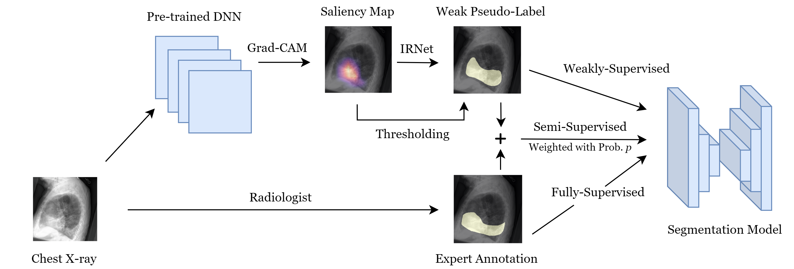

# CheXseg
Repo for project on combing expert annotations with DNN-generated saliency maps for chest X-ray segmentation: https://arxiv.org/abs/2102.10484.



## Pre-trained Models
Model checkpoints from our experiments are available for download [here](https://stanfordmedicine.box.com/s/ze675l76emijpd5021mkwidosot445cm).

## Installation

**Python 3.7.6** was used in this repo.

### Pip

Install the dependencies from requirements.txt:
```
pip install -r requirements.txt
```

### Virtual Environment - Poetry

Install poetry: https://python-poetry.org/docs/#installation

Before your first use, create the virual environment with provided dependencies:
```
poetry install
```

Before every use, activate the virtual environment:
```
source $(poetry env info --path)/bin/activate
```

## Setting environment variables
Set the following environment variables which are used in `constants.py` as part of `~/.bashrc`:
```
export CHEXPERT_DATA_DIR=<The directory containing CheXpert data>
export OBJ_EFFICIENCY_BASE_PATH=<The directory which will store all data related to CheXseg>
export TEST_SEG_LABELS_GT_BASE_PATH=<The directory containing test/validation sets>
```
## Generating Pseudo-Labels

**Grad-CAM Training**

CAMs are generated using the Grad-CAM method. Run 
```
python test.py --batch_size 16 \
--ckpt_path <PATH_TO_PRETRAINED_RESNET> \
--phase test \
--save_dir_predictions $OBJ_EFFICIENCY_BASE_PATH/train_cams \
--save_cams True \
--save_train_cams True
```
The pre-trained resnet model is called `epoch=2-chexpert_competition_AUROC=0.89.ckpt` and is stored [here](https://stanford.box.com/s/ze675l76emijpd5021mkwidosot445cm). Download it and use the path as PATH_TO_PRETRAINED_RESNET. The CAMs will get saved in `<OBJ_EFFICIENCY_BASE_PATH>/train_cams_temp/2ywovex5_epoch\=2-chexpert_competition_AUROC\=0.89.ckpt`.

These saliency maps are further processed to create per-pixel segmentation masks using a thresholding scheme:
```
cd localization_eval/
python pred_segmentation.py --phase train \
--map_dir $OBJ_EFFICIENCY_BASE_PATH/train_cams/2ywovex5_epoch=2-chexpert_competition_AUROC=0.89.ckpt \
--method gradcam \
--model_type single
```

## Converting to HDF5
HDF5 file format allows for efficient dataloading. Use the following to convert the dataset to HDF5:
```
cd IRNet
python convert_to_hdf5.py
```

**IRNet Training**

First step is to generate the IRNet labels from the CAMs:
```
python cam_to_ir_label_hdf5.py
```

The previously generated saliency maps can be used to create per-pixel segmentation masks using the IRNet method:
```
python train_irnet.py --lr <LEARNING_RATE, DEFAULT=0.01> \
--weight_decay <WEIGHT_DECAY, DEFAULT=0.0> \
--num_epochs <NUM_EPOCHS>
```
The best model will be saved as ```best_ir_model_hdf5_lr_<LEARNING_RATE>_weight_decay_<WEIGHT_DECAY>.pth``` in ```$OBJ_EFFICIENCY_BASE_PATH/weakly_supervised/saved_models```

**Generate Per-Pixel Segmentation Masks**

Generate the per-pixel segmentation masks from both the Grad-CAM and IRNet method:
```
cd ..
python make_pseudo_seg_labels.py \
--irn_pseudo_labels_save_dir $OBJ_EFFICIENCY_BASE_PATH/train_cams/ 2ywovex5_epoch=2-chexpert_competition_AUROC=0.89.ckpt \
--irn_best_model_name <IRNET_MODEL_NAME> \
--irn_is_training True
```

## Generate a subset (length 100 in our case) from the pseudo segmentation labels (Only for semi-supervised)
```
python create_train_set_subsets.py --subset_len <subset_length, DEFAULT=100> --pseudo_labels_type <type_of_labels, DEFAULT=cams>
```

This will create the encoded masks as a json file in ```$OBJ_EFFICIENCY_BASE_PATH/train_cams_temp_test/2ywovex5_epoch\=2-chexpert_competition_AUROC\=0.89.ckpt/```

## Training segmentation model

Use the following commands to train on only DNN-generated saliency maps, only expert annotations, or both.

Model trained on just DNN-generated saliency maps:
```
python segmentation_train.py \
--save_dir seg_trials \
--experiment_name weakly_supervised \
--wandb_project_name seg_trials  \
--wandb_run_name weakly_supervised \
--train_masks_path <PATH_TO_JSON_FILE_WITH_PSEUDO_LABELS, either cams or irnet> \ 
--eval_masks_path <PATH_TO_JSON_FILE_WITH_EVALUATION_LABELS> \
--architecture DeepLabV3Plus \
--encoder resnet18 \
--encoder_weights_type CheXpert \
--encoder_weights <PATH_TO_CHEXPERT_ENCODER_WEIGHTS> \
--num_epochs 20
```

Model trained on just expert annotations:
```
python segmentation_train.py \
--save_dir seg_trials \
--experiment_name fully_supervised \
--wandb_project_name seg_trials \
--wandb_run_name fully_supervised \
--train_set valid \
--train_masks_path <PATH_TO_JSON_FILE_WITH_147_VALIDATION_LABELS> \
--eval_masks_path <PATH_TO_JSON_FILE_WITH_40_VALIDATION_LABELS> \
--architecture DeepLabV3Plus \
--encoder resnet18 \
--encoder_weights_type CheXpert \
--encoder_weights <PATH_TO_CHEXPERT_ENCODER_WEIGHTS> \
--valid_common_pathologies True \
--num_epochs 20
```

Model trained on both expert annotations and DNN-generated saliency maps:
```
python segmentation_train.py \
--save_dir seg_trials \
--experiment_name semi_supervised \
--wandb_project_name seg_trials \
--wandb_run_name semi_supervised \
--ss_expert_annotations_masks_path <PATH_TO_JSON_FILE_WITH_147_VALIDATION_LABELS> \
--ss_dnn_generated_masks_path <PATH_TO_JSON_FILE_WITH_PSEUDO_LABELS, either cams or irnet> \
--eval_masks_path <PATH_TO_JSON_FILE_WITH_40_VALIDATION_LABELS> \
--architecture DeepLabV3Plus \
--encoder resnet18 \
--encoder_weights_type CheXpert \
--encoder_weights <PATH_TO_CHEXPERT_ENCODER_WEIGHTS> \
--semi_supervised True \
--weighted True \
--strong_labels_weight 0.9 \
--valid_common_pathologies True \
--num_epochs 20
```

## CheXseg
For CheXseg results, generate the segmentation masks using IRNet. Then, use these masks to train the semi-supervised model.

## License

This repository is made publicly available under the MIT License.

## Citing

If you are using this repo, please cite this paper:

```
@article{gadgil2021chexseg,
  title={CheXseg: Combining Expert Annotations with DNN-generated Saliency Maps for X-ray Segmentation},
  author={Gadgil, Soham and Endo, Mark and Wen, Emily and Ng, Andrew Y and Rajpurkar, Pranav},
  journal={arXiv preprint arXiv:2102.10484},
  year={2021}
}
```

